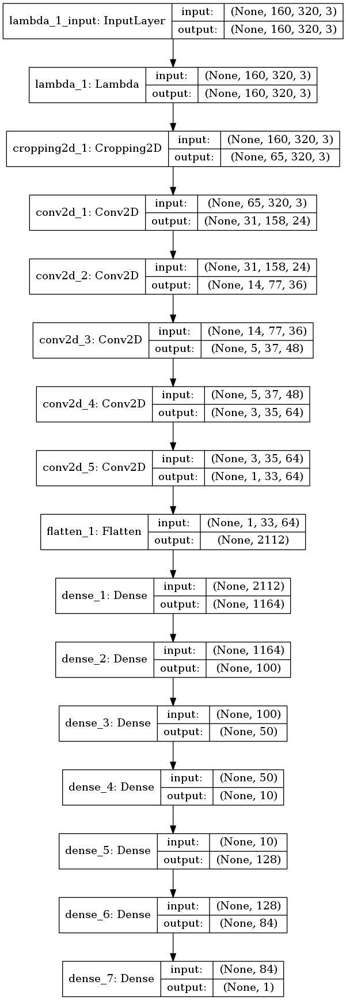

# **Behavioral Cloning** 

---

**Behavioral Cloning Project**

The goals / steps of this project are the following:
* Use the simulator to collect data of good driving behavior
* Build, a convolution neural network in Keras that predicts steering angles from images
* Train and validate the model with a training and validation set
* Test that the model successfully drives around track one without leaving the road
* Summarize the results with a written report


[//]: # (Image References)

[image1]: ./examples/placeholder.png "Model Visualization"
[image2]: ./examples/placeholder.png "Grayscaling"
[image3]: ./examples/placeholder_small.png "Recovery Image"
[image4]: ./examples/placeholder_small.png "Recovery Image"
[image5]: ./examples/placeholder_small.png "Recovery Image"
[image6]: ./examples/placeholder_small.png "Normal Image"
[image7]: ./examples/placeholder_small.png "Flipped Image"

## Rubric Points
### Here I will consider the [rubric points](https://review.udacity.com/#!/rubrics/432/view) individually and describe how I addressed each point in my implementation.  

---
### Files Submitted & Code Quality

#### 1. Submission includes all required files and can be used to run the simulator in autonomous mode

My project includes the following files:
* model.py containing the script to create and train the model
* drive.py for driving the car in autonomous mode
* model_nvidia_arch_run2.h5 containing a trained convolution neural network 
* writeup_behavioral.md summarizing the results

#### 2. Submission includes functional code
Using the Udacity provided simulator and my drive.py file, the car can be driven autonomously around the track by executing 
```sh
python drive.py model_nvidia_arch_run2.h5
```

#### 3. Submission code is usable and readable

The model.py file contains the code for training and saving the convolution neural network. The file shows the pipeline I used for training and validating the model, and it contains comments to explain how the code works.

### Model Architecture and Training Strategy

#### 1. An appropriate model architecture has been employed

The model I have used for training is inspired from [Nvidia's blog](https://devblogs.nvidia.com/deep-learning-self-driving-cars/) and architecture discussed in Lecture 15. Even More Powerful Networks.

My model consists of 5 convolutional layers with 5x5 and 3x3 filter sizes and depths upto 64. It is then Flatten into 1D and 7 Dense layers are applied to get the steering angle output.

Before passing the image to the convolutional layer, it is first normalized and then cropped to get the region of interest.

The convolutional layers use RELU as activation function to introduce non-linearity. There is no dropout used, same as the one used by nvidia. The model works really well and the car is able to stay on track for the complete lap.

The video can be found [here](./nvidia_run2.mp4)

#### 2. Attempts to reduce overfitting in the model

In order to reduce overfitting i.e., always turning left, since the Track 1 consists of majorly left turns, I have used opencv's flip() to create right turn samples and along with that corresponding steering angle is multiplied by -1.

The model was tested by running it through the simulator and ensuring that the vehicle could stay on the track.

#### 3. Model parameter tuning

The model uses an adam optimizer, so the learning rate was not tuned manually.

#### 4. Appropriate training data

I tried to create the training data for different scenarios, but due to the frame rate of the simulator in browser I was unable to create a good training data set. Hence, I used the Udacity provided data set for training the model, which works really well for Track 1 autonomous driving.

### Model Architecture and Training Strategy

#### 1. Solution Design Approach

Initially I started with normal convolutional layer, flatten and dense layer as shown in the lectures. I found out that the car would always keep the steering in either left or right direction and go around in circles.

Later, I add normalization, cropping layer and some more conv and dense layers, it worked a bit better but still not within the lane.

Then I tried the nvidia architecture mentioned in Lecture 15. and used the provided training data set instead. Initial run, I was able to get good result, although it was going off track when the lane was replaced with dirt part i.e., towards the end of the lap.

I then tweaked the model and added some more dense layers and increased the epoch upto 25 and finally my model was able to complete the whole lap without going off track :) It works well for Track 1. Track 2 is a bit challenging and I am unable to create a proper training set from within the simulator, even in the lowest graphic setting. Maybe it the browser or my laptop.

At the end of the process, the vehicle is able to drive autonomously around the track 1 without leaving the road.

#### 2. Final Model Architecture

The final model architecture (model.py lines 84-107) consisted of a convolution neural network with the following layers and layer sizes as shown in the image below.

Here is a visualization of the architecture.



#### 3. Creation of the Training Set & Training Process

I tried to create a custom training set but due to frame rate issue, I was unable to create a proper train set. It was either too much steering or off track sometimes. Hence, I decided to use the provided data set for training.

I used scikit learn's split function to split data set into training and validation sample set. I made use of generators to create batch samples. This helps in running a large neural network on a big data set.

Also, to augment the data sat, I flipped the images using opencv flip() function and multiplied the angles with -1. This is done inorder to remove bias towards left turn, since the lap has mostly left turns only and the model learns to take only left turns.

Before feeding the data into the model, I have used normalization and cropping of image to remove the sky, trees, etc. on top and the hood of the car from the bottom.

I finally randomly shuffled the data set and put 20% of the data into a validation set. 

I used this training data for training the model. The validation set helped determine if the model was over or under fitting. I tried upto 25 epochs and noticed that in some cases it overfits on training data and performs bad on validation set. I found out that the ideal number of epochs was 5. I used an adam optimizer so that manually training the learning rate wasn't necessary.
